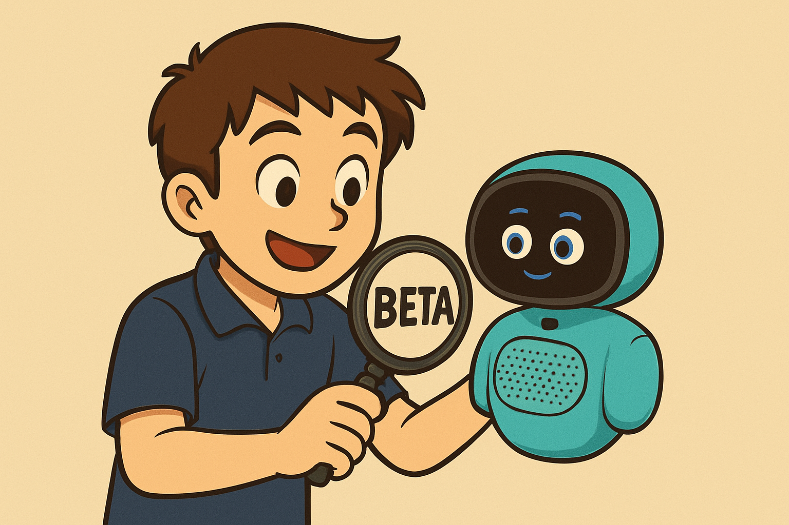

# Miko Mini Beta Testing Program Participation

##  Project: Miko Mini Beta Program
This repository documents my participation as a **beta tester** in the testing program for **Miko Mini**, an interactive AI companion robot designed to enrich children's lives through educational content and safe conversations.

My role focused on **Quality Assurance (QA)**, providing direct feedback on the product to influence the development roadmap, as outlined in the program's goals.

---

## About Miko and Miko Mini

**Miko** is a leading robotics company that creates intelligent companions.

**Miko Mini** is:
* An **interactive robot** that educates, entertains, and inspires young minds.
* It combines **educator-created content** with **AI interaction** to make it both a *learning partner* and a *friend*.

---

## Beta Testing Goals & Expectations

The **Miko Mini Beta Program** is an exclusive opportunity to gain early access to new features and become an integral part of the community-driven development process.

My key contributions were to:
1.  **Validate the robot's core functionality** and features.
2.  **Identify and report bugs** or usability issues.
3.  Provide **qualitative feedback** to enhance the overall user experience.
4.  Participate in **weekly testing cycles** and feedback submission via the official communication channel.

---

##  Beta and Product Teams

The program was facilitated by a dedicated Beta Team that served as the primary contact for feedback and activities:

| Name | Role in Beta Program | Reference |
| :--- | :--- | :--- |
| **Bakul Soni** | Beta Team Member / Go-to-crew on Slack | [See Documentation](/Documentation/Program_Overview.md) |
| **Simran Yadav** | Beta Team Member / Go-to-crew on Slack | [See Documentation](/Documentation/Program_Overview.md) |

*(Reference: Video Slides 0:19 - 0:25)*

###  Key Product Team Members
| Name | Title | Contribution Description |
| :--- | :--- | :--- |
| **Jinal Jobalia** | Content Head | Leads the creative mind behind Miko Mini's fun stories and games. |
| **Ayush Jain** | Principal Product Manager | Drives the innovation, blending creativity and technology for an engaging and educational product. |
| **Akshay** | Associate Product Manager - Design | Transforms ideas into an engaging and user-friendly experience, making Miko Mini visually captivating. |

*(Reference: Video Slides 0:26 - 0:33)*

---

##  Testing Documentation

## 📝 Testing Documentation

The core of my participation is documented across three key areas:

### 1. Test Planning and Strategy (`/TestPlan.md`)
*  [Miko Mini Beta Program: Test Plan](Documentation/Test_Plan.md): This document outlines the **strategic approach** to the Beta Program. It details the overall test objectives, **Entry/Exit criteria**, **Risk Management**, and the **iterative schedule** used to manage the six testing cycles.

### 2. Test Cases Log (`/TestCases`)
* **[AI Interaction Testing Log](/TestCases/AI_Interaction_Testing.md)**: A detailed log containing the **Cycle 0 Setup** and the subsequent **six cycles** of test cases. It documents the steps, expected results, and success criteria for all functional, AI interaction, and localization testing conducted.

### 3. Test Results (`/TestResults`)
This directory contains confidential logs and summaries of the outcomes from each testing cycle. This is where the **Pass/Fail results** and detailed **qualitative feedback** submitted to the Miko Beta Team are maintained.

### 4. Program Information (`/Documentation`)
* **[Program Overview](/Documentation/Program_Overview.md)**: A summary of the Miko Mini robot and the company's mission.
* **[Communication Channel](/Documentation/Communication_Channel.md)**: Confirms that **Slack** was the primary channel for all interactions, including receiving weekly activities and providing feedback. *(Reference: Video Slides 0:40 - 0:44)*

---

# Initial Setup and Troubleshooting Log

This document logs critical issues encountered during the initial Miko Mini setup and provides solutions verified by the Beta Team.

## 1. Device Charging Procedure
* **Issue:** Device does not charge when plugged in while powered off.
* **Resolution:** Confirmed that Miko Mini **charges only when it is turned ON** (power button pressed before plugging in). This is a vital difference from standard device charging protocols.

## 2. Spanish Language Update/Localization
* **Issue:** Miko remained in English even after the Spanish update was pushed remotely by the Miko Team.
* **Workaround:** The user manually triggered the language switch by saying the command: **"Hey Miko, can you speak in Spanish?"** This resolved the issue and allowed the device to begin responding in Spanish.

*Conclusion: Successfully ensured Miko was updated and fully operational in the primary testing language (Spanish) before commencing Cycle 1 activities.*

---

##  Next Steps

Detailed program specifics, including the testing cycle, feedback criteria, and incentives, were shared via Slack. This repository will be continuously updated with testing progress and results as the program moves forward.

*We appreciate your support and look forward to creating something great together!*
